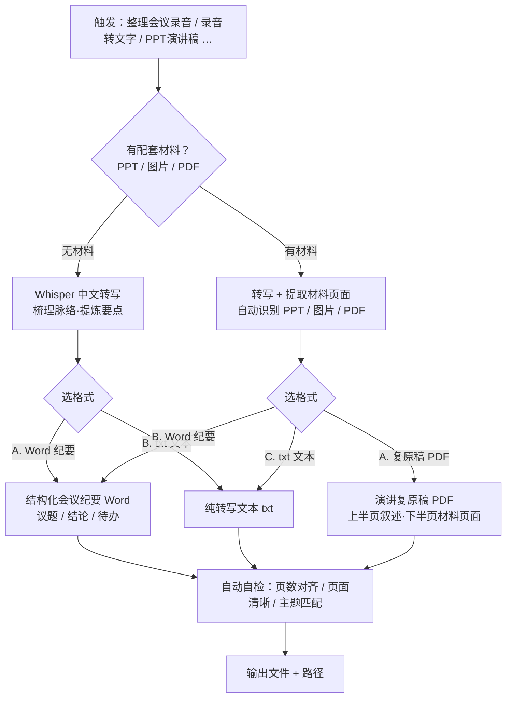

```mermaid
flowchart TD
    S["触发：整理会议录音 / 录音转文字 / PPT演讲稿 …"] --> Q{"有配套 PPT？"}
    Q -- "无 PPT" --> T1["Whisper 中文转写<br/>梳理脉络·提炼要点"]
    Q -- "有 PPT" --> T2["转写 + 提取 PPT<br/>页面文字 / 幻灯片截图"]
    T1 --> F1{"选格式"}
    T2 --> F2{"选格式"}
    F1 -- "A. Word 纪要" --> O1["结构化会议纪要 Word<br/>议题 / 结论 / 待办"]
    F1 -- "B. txt 文本" --> O2["纯转写文本 txt"]
    F2 -- "A. 复原稿 PDF" --> O3["演讲复原稿 PDF<br/>上半页叙述·下半页幻灯片"]
    F2 -- "B. Word 纪要" --> O1
    F2 -- "C. txt 文本" --> O2
    O1 --> C["自动自检：页数对齐 / 幻灯片清晰 / 主题匹配"]
    O2 --> C
    O3 --> C
    C --> D["输出文件 + 路径"]
```

# ⚠️ 触发即响应，不要去找文件

以下任一触发词，skill 激活后 **第一句话就是问材料**，禁止先去桌面搜索、禁止自行推断路径：

| 触发词 | 
|--------|
| 整理会议录音 / 会议录音整理 |
| 录音转文字 / 录音转演讲稿 / 语音转文字 / 音频转文字 |
| 语音识别 / 转写录音 / 转写音频 |
| PPT演讲稿 / 演讲复原稿 / 汇报稿 / PPT配音 |
| 会议纪要 / 逐字稿 / 文字稿 / 对话转写 |
| 录音转PPT / 音频PPT融合 / 图片转讲稿 |
| 帮我整理录音 / Whisper转写 |

---

# 材料类型判断

收到材料文件后，按扩展名自动识别类型：

| 类型 | 扩展名 | 页面提取方式 |
|------|--------|-------------|
| PPT | .pptx | python-pptx 提取文字 + LibreOffice/PyMuPDF 截图 |
| PDF | .pdf | PyMuPDF 逐页截图 + 文字提取 |
| 图片 | .png/.jpg/.jpeg/.gif/.bmp/.webp/.tiff | Pillow 直接读取，每张图 = 一页 |

多图片按文件名自然排序（01/02/03…）作为页码顺序。

---

# 流程总览（图）



---

# 工作流（极简三步）

## 第一步：先问材料

触发后**立即**询问，不干别的：

> 有没有配套材料（PPT / 图片 / PDF）？没有的话我直接转写整理，有的话请上传到对话框。

## 第二步：收文件，开干

**无材料**：直接对录音做完整中文转写（Whisper medium），梳理对话脉络、提炼要点。

**有材料**：用户上传后，自动识别类型（PPT/图片/PDF），转写录音 + 提取材料页面文字和截图。

## 第三步：选格式，输出

转写完成后：

**无材料：**
> 转写完成。要输出什么格式？
> A. 结构化会议纪要 Word（议题/结论/待办）
> B. 纯转写文本 txt
> 默认选 A。

**有材料：**
> 转写完成。要输出什么格式？
> A. 演讲复原稿 PDF（上半页叙述，下半页材料页面）
> B. 纯文字会议纪要 Word
> C. 纯转写文本 txt
> 默认选 A。

---

# 进度反馈

| 阶段 | 提示语 |
|------|--------|
| 触发后 | 「有没有配套材料（PPT/图片/PDF）？没有我直接转写，有的话传上来。」 |
| 转写中 | 「正在转写，预计 X 分钟...」 |
| 转写完 | 「转写完成，选格式：A/B/C」 |
| 生成完 | 自检结果 + 文件路径 |

---

# 模式详细说明

## 模式 A：演讲复原稿 PDF（需材料）
- 每页上半部分演讲叙述，下半部分材料页面（PPT 幻灯片 / PDF 页面 / 图片）
- 页数严格对齐材料页数（多图按自然排序）
- 自动自检

## 模式 B：会议纪要 Word
- 会议主题、参会人
- 按议题分段，含讨论要点 + 结论
- 末尾待办清单

## 模式 C：纯转写文本 txt
- 完整转写，带说话人标记

---

# 自检

- 转写文本非空、通顺
- 模式 A 额外：PDF 页数 = 材料页数、页面清晰、主题匹配
- 有问题直接修复

---

# 异常处理

| 情况 | 处理 |
|------|------|
| 音频格式不支持 | 提示转为 m4a/mp3/wav |
| 转写质量差 | 告知用户，建议更清晰录音 |
| 材料超 50 页 | 提醒耗时，确认后继续 |
| 只有材料没录音 | 提示需要录音 |
| 不支持的图片格式 | 提示转为 png/jpg |

---

# 技术执行

## 环境检查（每次执行前先跑，禁止跳过）

**第一步：检查依赖，缺啥装啥。**

```bash
# 逐个检查，只装缺失的
for pkg in openai-whisper python-pptx Pillow reportlab PyMuPDF python-docx; do
    pip show "$pkg" > /dev/null 2>&1 || pip install "$pkg" 2>&1
done
```

**第二步：检查 ffmpeg（音频预处理用，非必需但有最好）。**

```bash
which ffmpeg > /dev/null 2>&1 && echo "ffmpeg: OK" || echo "ffmpeg: 未安装，大文件转写可能较慢"
```

**第三步：检查 LibreOffice（PPT 截图优先方案，非必需）。**

```bash
which soffice > /dev/null 2>&1 && echo "LibreOffice: OK（优先截图方案）" || echo "LibreOffice: 未安装，将使用 python-pptx 降级方案"
```

> 检查完成后汇报结果再进入工作流。不重复安装已有的包。

## 音频转写
```python
import whisper
model = whisper.load_model("medium")
result = model.transcribe("录音文件", language="zh")
```
大文件预处理：`ffmpeg -i 录音.m4a -ac 1 -ar 16000 录音_16k.wav`

## 材料页面提取（仅模式 A）

按文件类型自动选择方案：

**PPT (.pptx)**：优先 LibreOffice — `soffice --headless --convert-to pdf 文件.pptx` → PyMuPDF 逐页截图；备选 python-pptx + Pillow 手工渲染。

**PDF (.pdf)**：PyMuPDF 逐页截图 + 文字提取。

**图片 (.png/.jpg/...)**：Pillow 直接读取，按文件名自然排序作为页码顺序。多张图片直接作为多页材料使用。

## PDF 生成（仅模式 A）
ReportLab / fpdf2，A4，叙述在上，材料页面在下

## Word 生成（模式 B）
python-docx，标题分级 + 表格待办

---

# 各平台获取方式

## WorkBuddy
对话中说「整理会议录音」「录音转文字」「AI演讲稿融合」即可自动触发。
首次安装：在 WorkBuddy 技能管理 → 通过 URL 导入，填入 `https://github.com/fulei223344-lang/ppt-speech-fusion`；或直接搜「AI演讲稿融合」「会议录音转写」即可找到并一键安装。

## Codex / Cursor / Claude Code / Copilot / Cline / Windsurf
复制本 SKILL.md 全文到项目根目录对应配置文件（`.codex.md` / `.cursor/rules/` / `CLAUDE.md` / `.github/copilot-instructions.md` / `.clinerules` / `.windsurfrules`）。

---

GitHub: github.com/fulei223344-lang/ppt-speech-fusion
SkillHub: skillId=137251----
name: ppt-speech-fusion
slug: ppt-speech-fusion
displayName: PPT演讲稿
description: 会议录音转写 + PPT 融合演讲复原稿 PDF。支持语音转文字 / 音频转文字 / 录音转写 / 会议纪要 / 逐字稿 / 文字稿 / 对话转写 / 汇报稿 / PPT配音 / 演讲复原稿 / 录音转PPT / 音频PPT融合。说「整理会议录音」「录音转文字」「语音识别」「PPT演讲稿」即可触发；先问有无 PPT，无 PPT 也可立即转写输出会议纪要 Word 或纯文本 txt，有 PPT 则生成逐页对齐演讲复原稿 PDF。基于 OpenAI Whisper 中文转写引擎，输出格式可选 PDF / Word / txt。
version: 2.1.3
author: ethan
---

# ⚠️ 触发即响应，不要去找文件

以下任一触发词，skill 激活后 **第一句话就是问 PPT**，禁止先去桌面搜索、禁止自行推断路径：

| 触发词 | 
|--------|
| 整理会议录音 / 会议录音整理 |
| 录音转文字 / 录音转演讲稿 / 语音转文字 / 音频转文字 |
| 语音识别 / 转写录音 / 转写音频 |
| PPT演讲稿 / 演讲复原稿 / 汇报稿 / PPT配音 |
| 会议纪要 / 逐字稿 / 文字稿 / 对话转写 |
| 录音转PPT / 音频PPT融合 |
| 帮我整理录音 / Whisper转写 |

---

# 流程总览（图）



---

# 工作流（极简三步）

## 第一步：先问 PPT

触发后**立即**询问，不干别的：

> 有没有配套 PPT？没有的话我直接转写整理，有的话请上传到对话框。

## 第二步：收文件，开干

**无 PPT**：直接对录音做完整中文转写（Whisper medium），梳理对话脉络、提炼要点。

**有 PPT**：用户上传 PPT 后，转写录音 + 提取 PPT 页面文字和幻灯片截图。

## 第三步：选格式，输出

转写完成后：

**无 PPT：**
> 转写完成。要输出什么格式？
> A. 结构化会议纪要 Word（议题/结论/待办）
> B. 纯转写文本 txt
> 默认选 A。

**有 PPT：**
> 转写完成。要输出什么格式？
> A. 演讲复原稿 PDF（上半页叙述，下半页幻灯片）
> B. 纯文字会议纪要 Word
> C. 纯转写文本 txt
> 默认选 A。

---

# 进度反馈

| 阶段 | 提示语 |
|------|--------|
| 触发后 | 「有没有配套 PPT？没有我直接转写，有的话传上来。」 |
| 转写中 | 「正在转写，预计 X 分钟...」 |
| 转写完 | 「转写完成，选格式：A/B/C」 |
| 生成完 | 自检结果 + 文件路径 |

---

# 模式详细说明

## 模式 A：演讲复原稿 PDF（需 PPT）
- 每页上半部分演讲叙述，下半部分 PPT 幻灯片截图
- 页数严格对齐 PPT
- 自动自检

## 模式 B：会议纪要 Word
- 会议主题、参会人
- 按议题分段，含讨论要点 + 结论
- 末尾待办清单

## 模式 C：纯转写文本 txt
- 完整转写，带说话人标记

---

# 自检

- 转写文本非空、通顺
- 模式 A 额外：PDF 页数 = PPT 页数、幻灯片清晰、主题匹配
- 有问题直接修复

---

# 异常处理

| 情况 | 处理 |
|------|------|
| 音频格式不支持 | 提示转为 m4a/mp3/wav |
| 转写质量差 | 告知用户，建议更清晰录音 |
| PPT 超 50 页 | 提醒耗时，确认后继续 |
| 只有 PPT 没录音 | 提示需要录音 |

---

# 技术执行

## 环境检查（每次执行前先跑，禁止跳过）

**第一步：检查依赖，缺啥装啥。**

```bash
# 逐个检查，只装缺失的
for pkg in openai-whisper python-pptx Pillow reportlab PyMuPDF python-docx; do
    pip show "$pkg" > /dev/null 2>&1 || pip install "$pkg" 2>&1
done
```

**第二步：检查 ffmpeg（音频预处理用，非必需但有最好）。**

```bash
which ffmpeg > /dev/null 2>&1 && echo "ffmpeg: OK" || echo "ffmpeg: 未安装，大文件转写可能较慢"
```

**第三步：检查 LibreOffice（PPT 截图优先方案，非必需）。**

```bash
which soffice > /dev/null 2>&1 && echo "LibreOffice: OK（优先截图方案）" || echo "LibreOffice: 未安装，将使用 python-pptx 降级方案"
```

> 检查完成后汇报结果再进入工作流。不重复安装已有的包。

## 音频转写
```python
import whisper
model = whisper.load_model("medium")
result = model.transcribe("录音文件", language="zh")
```
大文件预处理：`ffmpeg -i 录音.m4a -ac 1 -ar 16000 录音_16k.wav`

## PPT 截图（仅模式 A）
优先 LibreOffice：`soffice --headless --convert-to pdf 文件.pptx` → PyMuPDF 逐页截图
备选 python-pptx + Pillow 手工渲染

## PDF 生成（仅模式 A）
ReportLab / fpdf2，A4，叙述在上，截图在下

## Word 生成（模式 B）
python-docx，标题分级 + 表格待办

---

# 各平台获取方式

## WorkBuddy
对话中说「整理会议录音」「录音转文字」「PPT演讲稿」即可自动触发。
首次安装：在 WorkBuddy 技能管理 → 通过 URL 导入，填入 `https://github.com/fulei223344-lang/ppt-speech-fusion`；或直接搜「PPT演讲稿」「会议录音转写」即可找到并一键安装。

## Codex / Cursor / Claude Code / Copilot / Cline / Windsurf
复制本 SKILL.md 全文到项目根目录对应配置文件（`.codex.md` / `.cursor/rules/` / `CLAUDE.md` / `.github/copilot-instructions.md` / `.clinerules` / `.windsurfrules`）。

---

GitHub: github.com/fulei223344-lang/ppt-speech-fusion
SkillHub: skillId=137251
